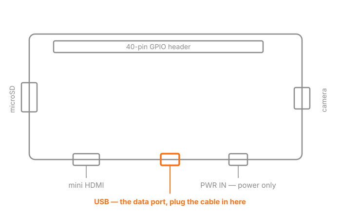

# Hardware

What Russignol runs on, the part numbers to order, and the traps that make a wrong part look right.

## Bill of materials

| Part | Order this | Approx. |
| --- | --- | --- |
| Board | Raspberry Pi Zero 2 W, **with headers** | US$21 |
| Display | Waveshare 2.13inch Touch e-Paper HAT — part **20716** (with case) or **19493** (bare) | US$30 / US$25 |
| Card | microSD, 8 GB or larger, high-endurance | US$10-15 |
| Cable | **Data** cable, micro-B at the device end, host end to match your baker | US$5 |

About US$70 all in. Prices are PiShop.us on 2026-09-08, there to set expectations rather than to quote.

You also need an SD card reader on whichever machine flashes the card. It does not have to be the baker.

## Board — Raspberry Pi Zero 2 W

Buy the **with headers** variant.

Only this board. The image ships a single device tree, `broadcom/bcm2710-rpi-zero-2-w`, and boots on nothing else — not the original Pi Zero or Zero W, whose ARMv6 core cannot run a 64-bit binary, and not a Pi 3, 4 or 5.

Raspberry Pi describes the standard board as having a "HAT-compatible 40-pin header footprint (unpopulated)". The display is a HAT and needs pins to sit on, so either buy a board a reseller has soldered a 2x20 male header onto, sold as "with headers" or "WH", or solder one yourself. The model dropdown on Raspberry Pi's own [product page](https://www.raspberrypi.com/products/raspberry-pi-zero-2-w/) offers "Raspberry Pi Zero 2 W with headers" and finds resellers by region.

The onboard radio is dead weight rather than exposure: WiFi and Bluetooth are compiled out of the kernel and disabled in firmware.

## Display — Waveshare 2.13inch Touch e-Paper HAT

- [2.13inch Touch e-Paper HAT](https://www.waveshare.com/2.13inch-touch-e-paper-hat.htm) — part 19493
- [2.13inch Touch e-Paper HAT (with case)](https://www.waveshare.com/2.13inch-touch-e-paper-hat-with-case.htm) — part 20716, the same HAT plus an ABS case, screwdriver, screws, thermal tape and feet

Either works. 20716 is the one in the photographs.

Three things make it the right part:

- **Touch.** The PIN is typed on the panel and never crosses USB. A panel with no touch layer leaves no way to unlock the device.
- **250x122, SSD1680 driver, GT1151 capacitive touch at I2C address 0x14.** Those are the numbers the driver is written to.
- **V4.** Waveshare has shipped V2, V3 and V4 of this panel under the same part number, and prints the revision on a label on the back. New stock is V4, which is what Russignol is tested on. Check the label on a used or old-stock unit.

Where a listing gives dimensions, they settle it on their own: the touch HAT is 69.15 x 38.90 mm and overhangs the board on both long sides, while the non-touch one is 65 x 30.2 mm, exactly the footprint of the Pi, and sits flush.

Displays that look right and are not:

| Product | Why not |
| --- | --- |
| 2.13inch e-Paper HAT, e-Paper HAT+ | right panel at 250x122, no touch layer, so no way to enter the PIN |
| 2.13inch e-Paper HAT (B), (G) | 250x122 color panels, three- and four-color, different controller, no touch |
| 2.13inch e-Paper HAT (C), (D) | 212x104, wrong resolution; (D) is the flexible one |
| 2.9inch Touch e-Paper HAT | right idea, wrong size at 296x128 |
| bare panel plus a driver board | no touch, and the wiring is yours to work out |

## Card — microSD

8 GB is the floor. Past that, size buys endurance rather than capacity: the factory image is about 300 MB, the keys and data partitions are created at first boot, and whatever is still unallocated stays that way as over-provisioning — spare blocks the card's controller wears through instead of the ones holding your keys.

Buy high-endurance, from a brand you recognize. The signer commits a watermark record before returning every signature, a small write every few seconds for the life of the device, and the firmware clocks the SD interface at 100 MHz, which counterfeit and bargain cards do not survive.

## Cable

One cable carries power and data both, so there is no separate power supply to buy.

- The device end is **micro-USB Type B**, and that end is fixed. The host end is whatever your baker host takes: USB-A on most desktops and servers, USB-C on a recent laptop or Mac. Either is fine, and so is an adapter on a cable you already own.
- It must be a **data** cable. Charge-only micro-USB cables have no data pair and are common in the bottom of a drawer. The symptom is a device that boots and displays but never appears on the host.
- It goes in the **middle** micro-USB socket, the OTG port beside the mini-HDMI. The socket at the corner of the board is PWR IN and carries power only. A cable there gives you a signer that lights up and cannot be reached.
- Plug into a host port directly, or into a self-powered hub. `russignol setup` warns when the device sits behind a bus-powered hub whose devices together exceed the 500 mA budget.

## Where to buy

Both parts, from one order:

| | Board | Display |
| --- | --- | --- |
| US | [PiShop.us](https://www.pishop.us/product/raspberry-pi-zero-2w-with-headers/) | [PiShop.us](https://www.pishop.us/product/2-13inch-touch-e-paper-e-ink-display-for-raspberry-pi-zero-250-122-abs-case/) |
| UK | [The Pi Hut](https://thepihut.com/products/raspberry-pi-zero-2) | [The Pi Hut](https://thepihut.com/products/2-13-touchscreen-e-paper-display-case-for-raspberry-pi-zero) |
| EU | [Welectron](https://www.welectron.com/Raspberry-Pi-Zero-2-W-with-Headers_1) | [Welectron](https://www.welectron.com/Waveshare-20716-213inch-Touch-e-Paper-HAT-with-case_1) |
| Elsewhere | [Raspberry Pi reseller finder](https://www.raspberrypi.com/products/raspberry-pi-zero-2-w/) | [Waveshare](https://www.waveshare.com/2.13inch-touch-e-paper-hat-with-case.htm) |

On The Pi Hut's board page, pick the pre-soldered header option before adding to the cart.

## Once it arrives

Before you go looking for a software fault:

- The panel's back label reads V4.
- The HAT seats fully on the header, all 40 pins.
- With a flashed card in and the cable in the middle socket, `lsusb -d 1d6b:0104` on the host lists the device. Nothing listed, after the display has come up, means a charge-only cable or the wrong socket.
