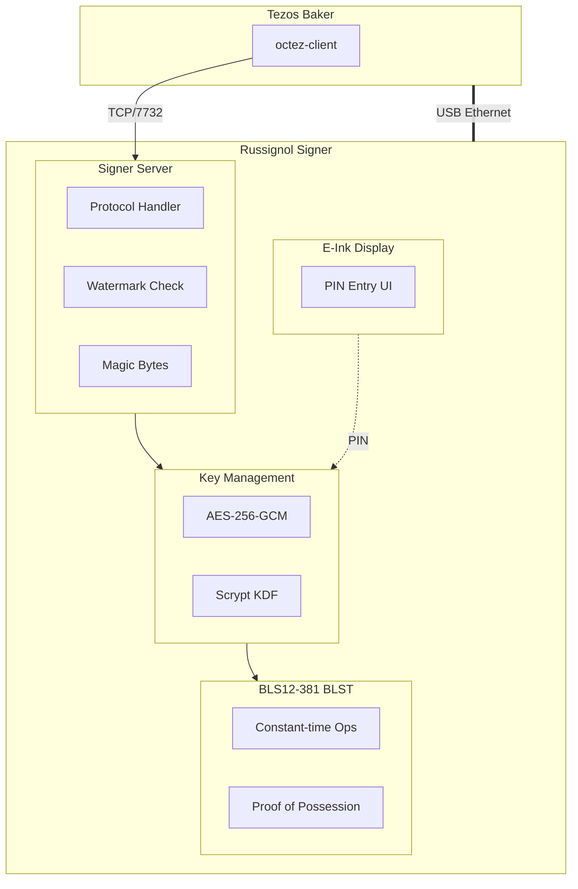

# Security Self-Assessment: Russignol Tezos Signer (Hardened Build)

**Date:** January 28, 2026
**Reviewer:** Self-assessment (not an independent third-party audit)
**Version:** 2.0
**Build Variant:** Hardened

> **Disclaimer:** This document is a self-assessment performed using automated code analysis tools. It is not a substitute for a formal third-party security audit. The findings and ratings reflect the reviewer's analysis of the codebase and configuration files.

## Executive Summary

This security assessment analyzes the Russignol project (hardened build), a hardware signer for the Tezos blockchain designed to run on a Raspberry Pi Zero 2W with an e-ink touchscreen display. The assessment covers security design, attack surfaces, custom distribution security, kernel configuration, and potential vulnerabilities.

### Operational Validation

- **Uptime:** 24/7 continuous operation for weeks
- **Thermal:** ~35°C typical operating temperature
- **Reliability:** Zero failures in extended testing

## Table of Contents

1. [Project Architecture](#1-project-architecture)
2. [Custom Distribution Security](#2-custom-distribution-security)
3. [Custom Kernel Analysis](#3-custom-kernel-analysis)
4. [Cryptographic Operations](#4-cryptographic-operations)
5. [Network Attack Surface](#5-network-attack-surface)
6. [Admin Command Attack Surface](#6-admin-command-attack-surface)
7. [Runtime Security Features](#7-runtime-security-features)
8. [Physical Attack Surface](#8-physical-attack-surface)
9. [Key Extraction Attacks](#9-key-extraction-attacks)
10. [Supply Chain Security](#10-supply-chain-security)
11. [Code Quality](#11-code-quality)
12. [Vulnerability Summary](#12-vulnerability-summary)
13. [Recommendations](#13-recommendations)
14. [Appendix C: PIN Brute-Force Cracking Estimates](#appendix-c-pin-brute-force-cracking-estimates)

## 1. Project Architecture

### 1.1 Overview

Russignol is a **specialized hardware signer for Tezos validators**, providing:
- PIN-protected BLS12-381 key storage
- Double-baking protection via high watermark tracking
- E-ink touchscreen interface for secure PIN entry
- Isolated network communication via USB Gadget Ethernet

### 1.2 System Architecture

## 2. Custom Distribution Security

### 2.1 Buildroot Configuration

The project uses Buildroot to create a minimal, purpose-built Linux distribution.

**Hardened Package Configuration:**

| Package | Status | Security Impact |
|---------|--------|-----------------|
| OpenSSH | ✅ Disabled | No remote access possible |
| BusyBox | ✅ Minimal | Reduced attack surface |
| F2FS-tools | Enabled | Filesystem support |
| inotify-tools | ✅ Disabled | Reduced attack surface |
| htop | ✅ Disabled | No process inspection |

### 2.2 User Configuration

**Security Properties:**
- ✅ Root account locked (no password, cannot login)
- ✅ `russignol` user locked (password hash set to `*`)
- ✅ Non-root user runs signer application
- ✅ Hardware groups have no login shell
- ✅ No SSH daemon running

### 2.3 BusyBox Hardening

**Disabled Utilities:**

| Category | Disabled Commands |
|----------|-------------------|
| Network | telnet, ftp, wget, netcat, traceroute, nslookup, arping |
| Editors | vi, ed |
| User Management | adduser, deluser, passwd |
| Debug | pstree, lsof, nmeter |

**Retained Utilities:**
- su (required for privilege drop at boot)
- ping, ip (minimal networking)
- grep, sed (text processing)
- logger (system logging)

## 3. Custom Kernel Analysis

### 3.1 Kernel Configuration

**Security Features Enabled:**

| Feature | Config | Status |
|---------|--------|--------|
| KASLR | `CONFIG_RANDOMIZE_BASE=y` | ✅ Enabled |
| F2FS | `CONFIG_F2FS_FS=y` | ✅ Enabled |
| No Swap | `# CONFIG_SWAP is not set` | ✅ Prevents key leakage |
| Legacy PTY | `CONFIG_LEGACY_PTYS` | ✅ Disabled |

### 3.2 Boot Configuration

**Assessment:**
- ✅ F2FS with strict fsync (data durability)
- ✅ Compression with checksums
- ✅ System halts on kernel panic (`panic=0`) - prevents exploitation of unstable state
- ✅ Read-only remount on errors
- ✅ Explicit init specification

### 3.3 Hardware Configuration

The device runs at stock clock speeds for maximum reliability.

**Operational Data:**
- Thermal: ~35°C typical operating temperature
- Reliability: **24/7 operation for weeks** without failures

**Assessment:** ✅ Hardware operates well within safe thermal margins.

## 4. Cryptographic Operations

### 4.1 BLS12-381 Implementation

**Library:** BLST (portable mode)

**Properties:**
- Constant-time operations (BLST library guarantee)
- Deterministic nonce generation
- Proof of Possession support
- Out-of-range keys are silently reduced to valid range (no logging)

### 4.2 Key Encryption

Keys are encrypted at rest using:
- **Algorithm:** AES-256-GCM (authenticated encryption)
- **KDF:** Scrypt (log_n=18, 256MB memory-hard)
- **Salt:** Random per encryption
- **Nonce:** 12-byte random

## 5. Network Attack Surface

### 5.1 Network Binding

**Address:** `169.254.1.1:7732` (Link-local)

| Property | Value | Security Impact |
|----------|-------|-----------------|
| Protocol | TCP | Reliable delivery |
| Encryption | None | Plaintext (relies on isolation) |
| Authentication | None | Disabled (relies on isolation) |
| Max Connections | 4 | DoS mitigation |
| Max Message Size | 64KB | Memory exhaustion prevention |

### 5.2 Input Validation

**Validation Checks:**
- ✅ Message length bounds
- ✅ Magic byte whitelist (0x11, 0x12, 0x13)
- ✅ Payload structure validation
- ✅ HTTP request detection (returns helpful error)

## 6. Admin Command Attack Surface

### 6.1 Authentication Status

**Design Decision:** Authentication is disabled by design.

The signer relies on **physical network isolation** (USB Gadget Ethernet) rather than cryptographic authentication. This is documented as intentional for the threat model.

### 6.2 Replay Protection

**Status:** Protected via High Watermark

The high watermark prevents re-signing at the same level/round:
- ✅ Level-based protection (monotonically increasing)
- ✅ Round-based protection (at same level)
- ✅ Persisted to disk via write-behind cache
- ✅ Loaded on startup

## 7. Runtime Security Features

### 7.1 Screensaver

The display enters sleep mode after 3 minutes of inactivity. Touch to wake. This is not a security lock - no PIN re-entry is required.

### 7.2 PIN Rate Limiting

Protection against brute-force PIN attacks:

- **Max Attempts:** 5 failed attempts before lockout
- **Lockout Duration:** Requires power cycle to retry

### 7.3 PIN Minimum Length

Enforced minimum PIN complexity:

- **Minimum Length:** 5 digits (~17 bits entropy)
- **Maximum Length:** 10 digits (~33 bits entropy)

### 7.4 Signing Activity Tracking

The signer tracks metadata about signing operations (not persisted to disk):

- **Tracked Data:** Operation type, level, timestamp, duration, data size
- **Purpose:** UI display of recent signing activity

### 7.5 Large Level Gap Detection

Protection against stale watermarks that could indicate misconfiguration:

- **Threshold:** 4 cycles worth of blocks
- **Behavior:** Prompts user confirmation via UI before signing

## 8. Physical Attack Surface

### 8.1 SD Card Analysis

| Location | Protection |
|----------|------------|
| Boot partition | None (required for boot) |
| Root filesystem | None (F2FS with checksums) |
| Key file | AES-256-GCM with PIN-derived key |

### 8.2 Debug Interfaces

| Interface | Status | Risk |
|-----------|--------|------|
| UART | ✅ Disabled | None |
| JTAG | ✅ Not enabled | None |
| SSH | ✅ Disabled (hardened) | None |
| GPIO | Restricted to russignol user | Low |
| Console Login | ✅ Locked accounts | None |

### 8.3 Side-Channel Attacks

| Attack Type | Vulnerability | Mitigation |
|-------------|---------------|------------|
| Timing | Observable signing latency | BLST constant-time |
| Power Analysis | Not protected | Physical isolation |
| Electromagnetic | Not protected | Physical isolation |
| Cold Boot | Keys in RAM after unlock | Power cycle recommended |

## 9. Key Extraction Attacks

### 9.1 Memory

- ASLR enabled
- Core dumps disabled in kernel
- Swap disabled (keys cannot be paged to disk)
- BLST library handles key zeroization on drop

### 9.2 Disk

Keys at rest are protected by AES-256-GCM with Scrypt KDF (log_n=18, 256MB memory-hard). Brute-force attacks are slowed by Scrypt's memory-hardness, which limits GPU parallelization.

## 10. Supply Chain Security

### 10.1 Rust Dependencies

**Assessment:**
- ✅ All dependencies pinned in Cargo.lock
- ✅ Recent versions of crypto libraries

### 10.2 Buildroot Sources

**Assessment:**
- ✅ Specific kernel commit hash pinned
- ✅ Official Raspberry Pi repository

## 11. Code Quality

- Unsafe code limited to `libc` FFI calls for privilege management
- Secrets passed in memory, never written to disk in plaintext
- Watermarks flushed to disk after each signature

## 12. Vulnerability Summary

### 12.1 Critical Issues

**None identified.** The hardened build has no critical vulnerabilities.

> **Note:** Authentication is disabled by design, relying on USB network isolation. Watermark persistence is implemented correctly. Hardware stability has been validated through extended 24/7 operation within safe thermal margins.

### 12.2 Medium-Risk Issues

| ID | Issue | Impact |
|----|-------|--------|
| M1 | Out-of-range key reduction | Silent key modification (no logging) |

### 12.3 Low-Risk Issues

| ID | Issue | Impact |
|----|-------|--------|
| L1 | Quiet boot mode | Hides boot issues |

## 13. Recommendations

### 13.1 Implemented Security Controls

The following security measures are in place:

1. **PIN Rate Limiting**: 5 failed attempts → lockout requiring power cycle
2. **PIN Minimum Length**: Enforced 5-digit minimum (~17 bits entropy)
3. **Large Gap Detection**: Warns on watermark gaps >4 cycles

### 13.2 Suggested Enhancements

| Enhancement | Benefit |
|-------------|---------|
| Persistent audit logging | Track signing operations across reboots |
| Watermark redundancy | Prevent corruption |
| Log out-of-range key reductions | Detect corrupted keys (addresses M1) |

## Appendix A: Threat Model Summary

### Trusted

- Physical possession of device
- USB connection to baker host
- PIN entry on touchscreen

### Untrusted

- Network beyond USB Gadget Ethernet
- SD card if device stolen
- RAM contents after power loss

### Out of Scope

- Attacks requiring kernel exploit
- Hardware implants
- Supply chain compromise of Rust/Buildroot

## Appendix B: Hardened Build Security Summary

| Security Control | Status |
|------------------|--------|
| SSH Access | ✅ Disabled |
| Root Login | ✅ Locked |
| User Login | ✅ Locked |
| Network Tools | ✅ Removed (telnet, ftp, wget, netcat) |
| Text Editors | ✅ Removed (vi, ed) |
| User Management | ✅ Removed (adduser, passwd) |
| Debug Tools | ✅ Removed (pstree, lsof) |
| Process Monitoring | ✅ Removed (htop) |
| File Watching | ✅ Removed (inotify-tools) |
| PIN Rate Limiting | ✅ Enabled |

## Appendix C: PIN Brute-Force Cracking Estimates

### Encryption Parameters

Keys are protected by AES-256-GCM with Scrypt KDF (log_n=18, 256MB memory-hard). The 256MB memory requirement severely limits GPU parallelization and makes ASICs impractical.

### Time to Crack

Assuming ~1 second per Scrypt hash on a single modern CPU:

| PIN Length | Keyspace | Single Machine | 100 Machines | 1000 Machines |
|------------|----------|----------------|--------------|---------------|
| 5 digits | 10^5 | ~1.2 days | ~17 min | ~2 min |
| 6 digits | 10^6 | ~12 days | ~2.8 hours | ~17 min |
| 7 digits | 10^7 | ~116 days | ~1.2 days | ~2.8 hours |
| 8 digits | 10^8 | ~3.2 years | ~12 days | ~1.2 days |
| 9 digits | 10^9 | ~32 years | ~116 days | ~12 days |
| 10 digits | 10^10 | ~317 years | ~3.2 years | ~116 days |

### Notes

- **GPU attacks limited**: 256MB per attempt means a 24GB GPU can only run ~96 parallel operations (vs millions for weak KDFs)
- **Average case**: Expected crack time is half the maximum (attacker finds PIN midway through keyspace on average)
- **Offline attack**: These estimates assume offline attack on extracted SD card; the 5-attempt lockout only protects against on-device attacks

### Recommendations

| PIN Length | Security Level |
|------------|----------------|
| 5-6 digits | Vulnerable to determined attacker with modest resources |
| 7-8 digits | Reasonable for typical threat models |
| 9-10 digits | Strong protection even against well-funded attackers |

---

*Self-assessment performed January 28, 2026*
