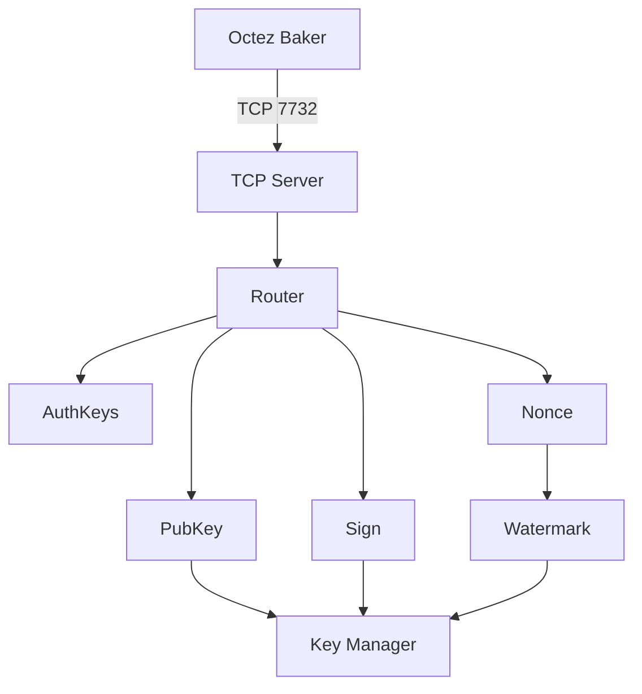

# Development Guide

Developer documentation for the russignol-signer library implementation.

## Table of Contents
1. [Project Architecture](#project-architecture)
2. [TCP Server Implementation](#tcp-server-implementation)
3. [Testing Guide](#testing-guide)
4. [Test Results](#test-results)

## Project Architecture

### Overview

Successfully ported the Tezos `russignol-signer` from OCaml to Rust with specific optimizations for the **Raspberry Pi Zero 2W** (ARM Cortex-A53 CPU).


### Implemented Features

#### 1. BLS12-381 Cryptography
- Secret key generation and management
- Public key derivation
- Public key hash (tz4 addresses)
- Signature generation and verification
- Proof of possession (PoP)
- Deterministic nonce (RFC 6979 style)
- Deterministic nonce hash

#### 2. Magic Byte Filtering
- Tenderbake block (0x11) ✓
- Tenderbake preattestation (0x12) ✓
- Tenderbake attestation (0x13) ✓
- Rejection of legacy Emmy operations (0x01, 0x02) ✓

#### 3. Base58Check Encoding
- tz4 (public key hash) encoding/decoding
- BLpk (public key) encoding/decoding
- BLsk (secret key) encoding/decoding
- BLsig (signature) encoding/decoding

#### 4. High Watermark Protection
- Level-based protection against double-baking
- Round-based protection for same level
- Separate watermarks per operation type
- Persistent storage across restarts
- Per-key watermark tracking

#### 5. TCP Server
- Async TCP server with Tokio
- Binary protocol encoding/decoding
- Key manager for multiple keys
- Request routing and handling
- Error handling and responses

## TCP Server Implementation

### Architecture



### Protocol Format

#### Message Framing

| Length (2B) | Type (1B) | Payload (var) |
|-------------|-----------|---------------|

#### Request Types
- `0x00` - Sign
- `0x01` - Public Key
- `0x02` - Authorized Keys
- `0x03` - Deterministic Nonce
- `0x04` - Deterministic Nonce Hash
- `0x05` - Supports Deterministic Nonces
- `0x06` - Known Keys
- `0x07` - BLS Prove Request

#### Response Types
- `0x00` - Signature
- `0x01` - Public Key
- `0x02` - Authorized Keys
- `0x03` - Nonce
- `0x04` - Nonce Hash
- `0x05` - Bool
- `0x06` - Known Keys
- `0xFF` - Error

### Watermark File Format
```json
{
  "block": {
    "level": 1234567,
    "round": 0,
    "hash": "BLockGenesisGenesisGenesisGenesisb83baZgbyZe",
    "signature": "BLsig..."
  },
  "preattestation": {
    "level": 1234567,
    "round": 0
  },
  "attestation": {
    "level": 1234567,
    "round": 0
  }
}
```

## Testing Guide

### Running Tests

```bash
# Run all tests
cargo test

# Run with output
cargo test -- --nocapture

# Run specific module tests
cargo test bls::
cargo test protocol::
cargo test tcp_server::

# Run with coverage
cargo tarpaulin --out Html
```

### Integration Testing

The TCP server can be tested with actual Octez clients:

```bash
# Start the signer
cargo run --release -- tcp 0.0.0.0:7732 --base-dir ~/.tezos-signer

# Import a key
octez-client import secret key my_baker tcp://localhost:7732/tz4...

# Sign with the baker
octez-client sign bytes 0x11... for my_baker

# Check watermark files
cat ~/.tezos-signer/<chain_id>/<pkh>.json
```

### Test Coverage by Module

#### BLS Module
- Key generation, Base58 encoding
- Sign and verify (with and without watermark)
- Proof of possession, Deterministic nonce

#### Magic Bytes Module
- Magic byte enum conversion and validation
- Tenderbake-only filtering (0x11, 0x12, 0x13)
- Level/round extraction from blocks and attestations

#### Watermark Module
- Level and round-based protection
- Per-operation-type and per-key isolation
- Persistence across instances

#### Protocol Module
- Request/response encoding and decoding
- Roundtrip validation for all message types

#### Signer Module
- Core signing operations
- Handler with magic byte restrictions
- BLS proof of possession

#### TCP Server Module
- Key manager operations
- Request handler for all request types

## Test Results

### Summary

All unit tests passing across modules:
- Base58check encoding
- BLS cryptography
- Magic bytes
- High watermark
- Protocol encoding
- Signer logic
- TCP Server

### TCP Server Features Verified

#### ✅ Request Handling
- [x] Sign requests with watermark checking
- [x] Public key retrieval
- [x] Known keys listing
- [x] Deterministic nonce generation
- [x] Error responses

#### ✅ Key Management
- [x] Multiple key support
- [x] Key loading from base58
- [x] Public key hash derivation
- [x] Key not found error handling

#### ✅ Watermark Protection
- [x] Level/round checking
- [x] Persistent storage
- [x] Per-operation-type watermarks
- [x] Per-key isolation
- [x] Double-baking prevention

#### ✅ Protocol Compliance
- [x] Binary message framing
- [x] Request/response encoding
- [x] Error handling
- [x] All request types supported

## Development Workflow

See [CONTRIBUTING.md](../../CONTRIBUTING.md) for project-wide development guidelines including:
- Building and cross-compilation
- Code style and formatting
- Debugging tips
- Contributing workflow
- Common pitfalls
