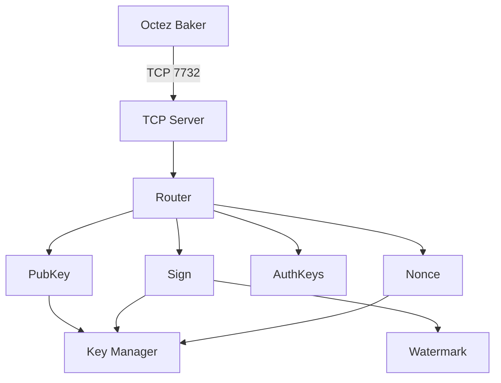

# Development Guide

Developer documentation for the russignol-signer library implementation.

## Table of Contents
1. [Project Architecture](#project-architecture)
2. [Library API Overview](#library-api-overview)
3. [TCP Server Implementation](#tcp-server-implementation)
4. [High Watermark Storage](#high-watermark-storage)
5. [Feature Flags](#feature-flags)
6. [Testing Guide](#testing-guide)
7. [Test Results](#test-results)

## Project Architecture

### Overview

A port of the Tezos `octez-signer` from OCaml to Rust with specific optimizations for the **Raspberry Pi Zero 2W** (ARM Cortex-A53 CPU).


### Implemented Features

#### 1. BLS12-381 Cryptography
- Secret key generation and management
- Public key derivation
- Public key hash (tz4 addresses)
- Signature generation and verification
- Proof of possession (PoP)
- Deterministic nonce (RFC 6979 style)
- Deterministic nonce hash

#### 2. Magic Byte Filtering
- Tenderbake block (0x11) ✓
- Tenderbake preattestation (0x12) ✓
- Tenderbake attestation (0x13) ✓
- Rejection of legacy Emmy operations (0x01, 0x02) when the filter is enabled ✓
- No filter configured = all magic bytes allowed

#### 3. Base58Check Encoding
- tz4 (public key hash) encoding/decoding
- BLpk (public key) encoding/decoding
- BLsk (secret key) encoding/decoding
- BLsig (signature) encoding/decoding

#### 4. High Watermark Protection
- Level-based protection against double-baking
- Round-based protection for same level (round must be strictly higher)
- Separate watermarks per operation type
- Per-key watermark tracking
- Persistent storage across restarts (pwrite + fdatasync before returning a signature)
- Watermarks must be initialized before the first signature
- Corrupt watermark files refuse to load (manual re-initialization required)

#### 5. TCP Server
- Synchronous TCP server, one thread per connection (default limit: 4)
- Binary protocol encoding/decoding
- Key manager for multiple keys
- Request routing and handling
- Error handling and responses

## Library API Overview

A map of the public API; see the module docs (`cargo doc --open`) for details.

| Module | Contents |
|--------|----------|
| `bls` (`src/bls.rs`) | `SecretKey`, `PublicKey`, `PublicKeyHash`, `Signature`, `sign`/`verify`, `pop_prove`/`pop_verify`, `generate_key`, deterministic nonces, base58check prefixes |
| `magic_bytes` (`src/magic_bytes.rs`) | `MagicByte`, `check_magic_byte`, level/round/chain-ID extraction from Tenderbake payloads |
| `signer` (`src/signer.rs`) | `Unencrypted` signer, `Handler` (magic-byte-filtering wrapper), `SignatureVersion` |
| `protocol` (`src/protocol.rs`) | `SignerRequest`, `SignerResponse`, `encoding::{encode_request, decode_request, encode_response, decode_response}` |
| `high_watermark` (`src/high_watermark.rs`) | `HighWatermark`, `WatermarkUpdate`, `ChainId`, `WatermarkError` |
| `server` (`src/server.rs`) | `Server`, `RequestHandler`, `KeyManager` (re-exported as `ServerKeyManager`), `KEY_ROLES` |
| `wallet` (`src/wallet.rs`) | `KeyManager` for OCaml-format wallet files, `StoredKey` |
| `signing_activity` (`src/signing_activity.rs`) | `SigningActivity`, `SigningEvent`, `SigningEventRing` — per-key signing metrics |
| `test_utils` (`src/test_utils.rs`) | Builders for Tenderbake test payloads, watermark pre-initialization helpers |

Notable API points:

- **`RequestHandler` builder callbacks** (`src/server.rs`): `with_signing_activity`, `with_watermark_error_callback`, `with_signing_notify`, `with_large_gap_callback` (enables rejection of sign requests more than 4 cycles ahead of the current watermark), `with_pre_sign_callback` / `with_post_sign_callback` (e.g. CPU frequency boost/restore).
- **`Server` configuration** (`src/server.rs`): `with_max_message_size` (default 64 KiB), `with_max_connections` (default 4), `with_connection_counter`.
- **`KEY_ROLES` ordering contract** (`src/server.rs`): `KeyManager::list_keys()` returns the consensus key first, then the companion key; the host utility relies on this ordering.
- **`HighWatermark` write path** (`src/high_watermark.rs`): `check_and_update` advances the in-memory watermark and returns a `WatermarkUpdate`; `write_watermark` persists it (pwrite + fdatasync) before the signature is returned; `rollback_update` / `rollback_disk_watermark` undo a failed sign. `write_ceiling` / `ceiling_covers` implement the ceiling optimization (see below).
- **`wallet::KeyManager` split storage** (`src/wallet.rs`): `new_with_secret_keys_path` keeps `secret_keys` in a separate directory (e.g. tmpfs for decrypted keys); `gen_keys_in_memory` generates without disk writes; `save_public_keys_only` never writes secret keys.

## TCP Server Implementation

### Architecture


```mermaid
flowchart TB
    client[Octez Baker]
    server[TCP Server]
    router[Router]
    sign[Sign]
    pubkey[PubKey]
    authkeys[AuthKeys]
    nonce[Nonce]
    keymgr[Key Manager]
    watermark[Watermark]

    client -->|TCP 7732| server
    server --> router
    router --> sign
    router --> pubkey
    router --> authkeys
    router --> nonce
    pubkey --> keymgr
    sign --> keymgr
    sign --> watermark
    nonce --> keymgr
```

The server is synchronous: an accept loop spawns one OS thread per connection (default limit: 4 concurrent connections). No async runtime is used.

### Protocol Format

#### Message Framing

Requests:

| Length (2B, BE) | Request tag (1B) | Payload (var) |
|-----------------|------------------|---------------|

Responses:

| Length (2B, BE) | Result tag (1B: 0x00 Ok / 0x01 Error) | Payload (var) |
|-----------------|----------------------------------------|---------------|

Responses carry **no request-type tag** — the client decodes the payload based on the request it sent. See [PROTOCOL_SPECIFICATION.md](PROTOCOL_SPECIFICATION.md) for the full wire format.

#### Request Tags
- `0x00` - Sign
- `0x01` - Public Key
- `0x02` - Authorized Keys
- `0x03` - Deterministic Nonce
- `0x04` - Deterministic Nonce Hash
- `0x05` - Supports Deterministic Nonces
- `0x06` - Known Keys
- `0x07` - BLS Prove Request

## High Watermark Storage

Watermarks are stored per key, in a subdirectory of the base directory named by the key's base58check PKH:

```
<base_dir>/<pkh_b58check>/
├── block_watermark
├── preattestation_watermark
└── attestation_watermark
```

Each file is exactly **40 bytes** of binary data:

| Offset | Size | Field |
|--------|------|-------|
| 0 | 4 | level (u32, big-endian) |
| 4 | 4 | round (u32, big-endian) |
| 8 | 32 | Blake3 hash of the first 8 bytes |

Semantics:

- A sign request must be at a strictly higher level, or at the same level with a strictly higher round, than the stored watermark
- An empty file means "no watermark yet"; signing is rejected (`NotInitialized`) until the watermark is initialized
- A file with the wrong size or a Blake3 mismatch is treated as corrupt and the signer refuses to load — manual re-initialization is required
- The watermark is written (pwrite at offset 0) and fdatasynced **before** the signature is returned; if the write fails, the signature is withheld
- **Ceiling optimization**: during idle time, a ceiling entry `(next_level, u32::MAX)` can be fdatasynced to disk (`write_ceiling`). A later sign at that level can then skip the fdatasync in the critical path (`ceiling_covers`), because any crash would reload the ceiling, which safely blocks that level

## Feature Flags

- `perf-trace` — logs per-stage timings for the sign path (magic byte check, watermark, BLS sign, TCP read/write) and tracks request concurrency (`src/server.rs`). For performance investigation only.

## Testing Guide

### Running Tests

```bash
# Run all tests
cargo test

# Run with output
cargo test -- --nocapture

# Run specific module tests
cargo test bls::
cargo test protocol::
cargo test server::
cargo test high_watermark::

# Workspace-wide (from the repo root; --no-fuzz skips proptest fuzzing)
cargo xtask test

# Run with coverage
cargo tarpaulin --out Html
```

### Integration and Property Tests

The `tests/` directory contains:

- `tcp_integration_test.rs` — end-to-end TCP server tests
- `race_watermark.rs` — concurrent watermark race conditions
- `crash_lock_poison.rs` — lock-poisoning recovery
- `dos_memory_exhaustion.rs` — oversized/malicious message handling
- `proptest_protocol.rs` — property-based protocol roundtrip fuzzing

Benchmarks live in `benches/signing_benchmark.rs` (criterion; run with `cargo bench`).

### Integration Testing with Octez

The TCP server can be tested with actual Octez clients:

```bash
# Start the signer against an existing octez wallet
cargo run --release -- --base-dir ~/.tezos-signer launch socket signer \
  --address 0.0.0.0 --port 7732 --check-high-watermark

# Import the remote key
octez-client import secret key my_baker tcp://localhost:7732/tz4...

# Sign with the baker
octez-client sign bytes 0x11... for my_baker

# Inspect watermark files (40-byte binary, per key)
xxd ~/.tezos-signer/<pkh>/block_watermark
```

### Test Coverage by Module

#### BLS Module
- Key generation, Base58 encoding
- Sign and verify (with and without watermark)
- Proof of possession, Deterministic nonce

#### Magic Bytes Module
- Magic byte enum conversion and validation
- Tenderbake-only filtering (0x11, 0x12, 0x13)
- Level/round extraction from blocks and attestations

#### Watermark Module
- Level and round-based protection
- Initialization requirement (rejects first signature without pre-configured watermark)
- Per-operation-type and per-key isolation
- Persistence across instances
- Corruption detection (size and Blake3 mismatch)
- Ceiling write/skip and rollback paths

#### Protocol Module
- Request/response encoding and decoding
- Roundtrip validation for all message types

#### Signer Module
- Core signing operations
- Handler with magic byte restrictions
- BLS proof of possession

#### TCP Server Module
- Key manager operations
- Request handler for all request types

## Test Results

### Summary

All unit tests passing across modules:
- Base58check encoding
- BLS cryptography
- Magic bytes
- High watermark
- Protocol encoding
- Signer logic
- TCP Server

### TCP Server Features Verified

#### ✅ Request Handling
- [x] Sign requests with watermark checking
- [x] Public key retrieval
- [x] Known keys listing
- [x] Deterministic nonce generation
- [x] Error responses

#### ✅ Key Management
- [x] Multiple key support
- [x] Key loading from base58
- [x] Public key hash derivation
- [x] Key not found error handling

#### ✅ Watermark Protection
- [x] Level/round checking
- [x] Persistent storage
- [x] Per-operation-type watermarks
- [x] Per-key isolation
- [x] Double-baking prevention

#### ✅ Protocol Compliance
- [x] Binary message framing
- [x] Request/response encoding
- [x] Error handling
- [x] All request types supported

## Development Workflow

See [CONTRIBUTING.md](../../CONTRIBUTING.md) for project-wide development guidelines including:
- Building and cross-compilation
- Code style and formatting
- Debugging tips
- Contributing workflow
- Common pitfalls
